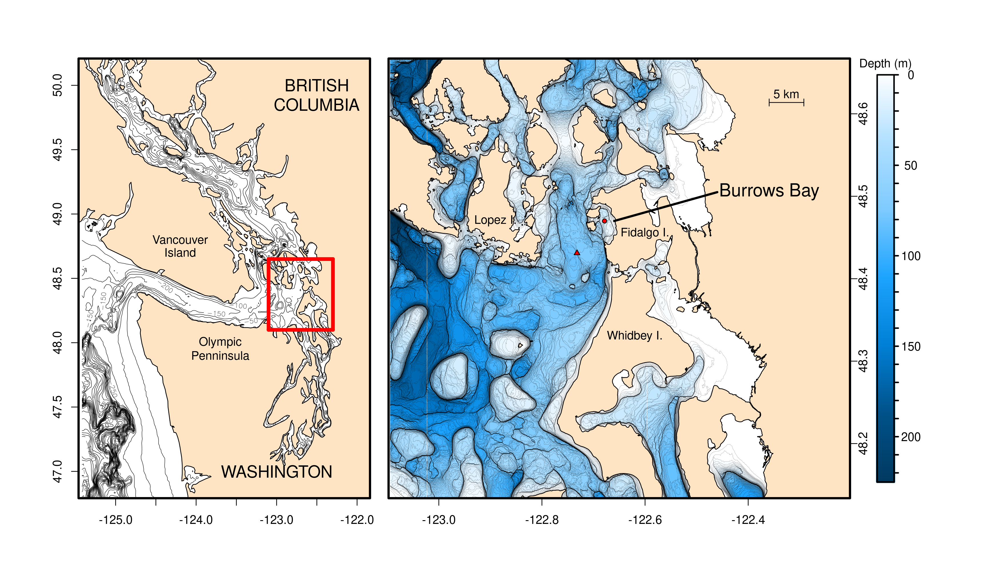

# Loading libraries
```{r, results='hide', message=FALSE, warning=FALSE}
library(plotKML)
library(maptools)
library(rgdal)
library(ggplot2)
library(geoR)
library(seacarb)
library(spatstat)
library(marmap)
library(ncdf4)
library(viridis)
library(colorRamps)
```

# Read in shapefiles
These shapefiles were found here: 
https://www.naturalearthdata.com/http//www.naturalearthdata.com/download/10m/physical/ne_10m_land.zip

https://www.naturalearthdata.com/http//www.naturalearthdata.com/download/10m/physical/ne_10m_minor_islands.zip

The shapefile of Washington State (sample.shp) came from the NOAA shoreline/coastline extractor:  https://www.ngdc.noaa.gov/mgg/shorelines/shorelines.html

xyz format bathymetry data was obtained from here: https://topex.ucsd.edu/cgi-bin/get_data.cgi

```{r}
global.shp=readShapePoly('ne_10m_land/ne_10m_land.shp')
minor.shp=readShapePoly('ne_10m_minor_islands/ne_10m_minor_islands.shp')
wash.shp=readShapePoly("./Shapefiles/sample.shp")
sanjuan.tab=read.table('sanjuan.xyz',header=F)
sanjuan=as.bathy(sanjuan.tab)
```


```{r}
salish=getNOAA.bathy(lon1=-125.44,lon2=-121.9,lat1=46.8,lat2=50.2,resolution=1)
blues <- colorRampPalette(c("steelblue4", "steelblue3",
                            "steelblue2", "steelblue1", "white"))
blues2=colorRampPalette(c("#003a61ff","#00528aff","#0080d6ff",
                            "#1da4fff7", "#7ecbffef","#b1e0ffef","white"))
```


# Making plot
I tried to first make this in as an SVG file, but the resulting file was very large and hard (impossible) to work with. I instead write it out to an TIFF format.
```{r}
tiff("Figure_1.tiff",width=14,height=8,units = "in",res=250)
par(fig=c(0.02,0.4,0,1))
plot(salish,asp=1.6,image=T,bpal="white",step=50,axes=F,ylab="",xlab="",drawlabels=T,lwd=0.5,
     deepest.isobath=-10000,shallowest.isobath=10)
plot(global.shp,col="bisque",bg="transparent",add=T,lwd=1)
plot(minor.shp,col="bisque",bg="transparent",add=T,lwd=1)
box(lwd=3)
lines(c(-123.1,-123.1),c(48.1,48.65),col="red",lwd=5)
lines(c(-122.3,-122.3),c(48.1,48.65),col="red",lwd=5)
lines(c(-122.3,-123.1),c(48.1,48.1),col="red",lwd=5)
lines(c(-122.3,-123.1),c(48.65,48.65),col="red",lwd=5)
text(-123.7,48,"Olympic")
text(-123.7,47.9,"Penninsula")
text(-124.2,48.8,"Vancouver")
text(-124.2,48.7,"Island")
text(-122.5,50,"BRITISH",cex=1.4)
text(-122.5,49.85,"COLUMBIA",cex=1.4)
text(-123,47,"WASHINGTON",cex=1.4)

axis(1,cex.axis=1)
axis(2,cex.axis=1)

par(fig=c(0.33,0.88,0,1),new=T)
plot(sanjuan,image=T,lwd=0.1,xlim=c(-123,-122.3),deepest.isobath=-2000,shallowest.isobath=0,
     bpal = blues2(100),drawlabels=F,asp=1.6,step=1,axes=F,ylab="",xlab="")
plot(wash.shp,col="bisque",bg="transparent",add=T,lwd=1)
box(lwd=3)
axis(1,cex.axis=1)
axis(4,cex.axis=1,padj=-1)
text(-122.6,48.455,"Fidalgo I.",cex=1)
text(-122.62,48.33,"Whidbey I.",cex=1)
text(-122.89,48.47,"Lopez I.",cex=1)
lines(c(-122.66,-122.46),c(48.47,48.505),lwd=3)
text(-122.47,48.505,pos=4,"Burrows Bay",cex=1.5)
points(-122.6786,48.47,pch=21,bg="red",cex=0.8) #Burrows Bay Collection Location
points(-122.732,48.431,pch=24,bg="red",cex=0.8) #Rosario Strait Collection Location
scaleBathy(sanjuan,deg=5/74.33643,x="topright")

par(fig=c(0,1,0,1),new=T)
plot(c(0,1),c(0,1),axes=F,type="n",ylab="",xlab="")
key.start=0.93
key.end=0.95
key.top=1
key.bottom=0
key.points=seq(from=key.top,to=key.bottom,length.out=1000)

for(i in 1:length(key.points)){
  lines(c(key.start,key.end),rep(key.points[i],2),col=blues2(1000)[1001-i],lwd=3)
}
lines(c(key.start,key.end,key.end,key.start,key.start),c(key.bottom,key.bottom,key.top,key.top,key.bottom),lwd=2)
text(mean(c(key.start,key.end)),key.top+0.025,"Depth (m)",cex=1)

for (i in 0:22){
  lines(c(0.95,0.955),c(1-(i*10/225),1-(i*10/225)),lwd=2)
}
text(0.97,1,0)
text(0.97,1-(50/225),50)
text(0.97,1-(100/225),100)
text(0.97,1-(150/225),150)
text(0.97,1-(200/225),200)

dev.off()

```

I use this short BASH command to convert the resulting TIFF file to PNG.  This requires the program imagemagick to be installed.
```{bash}
convert Figure_1.tiff Figure_1.png
```





